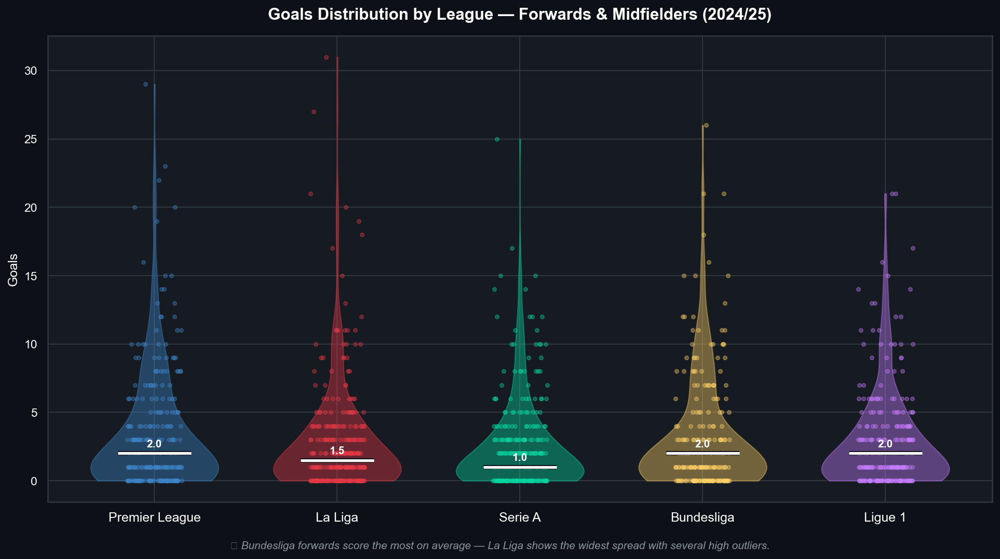
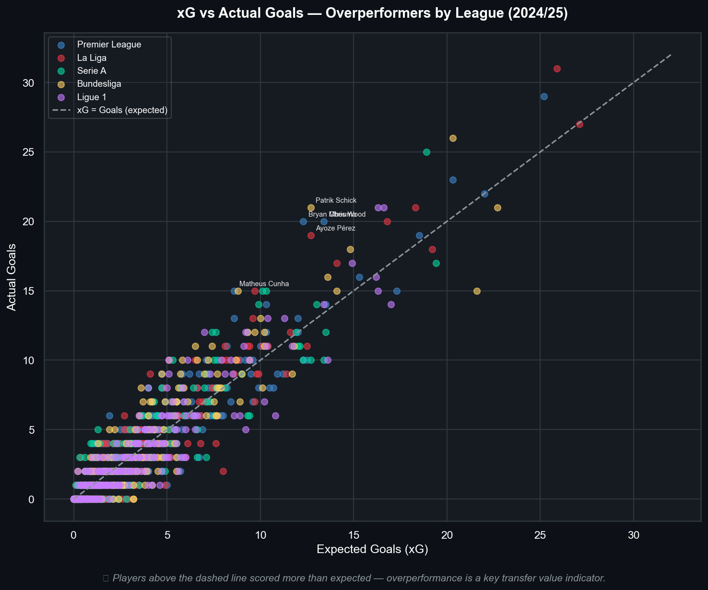
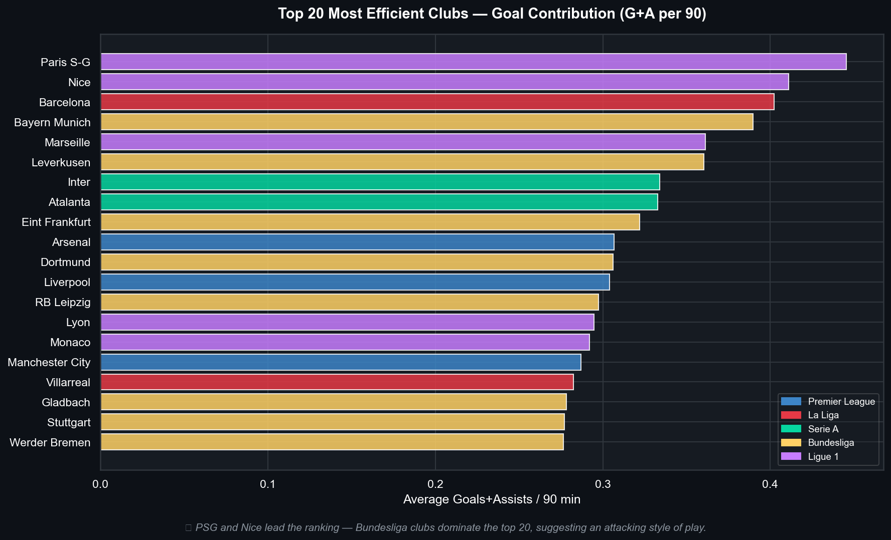
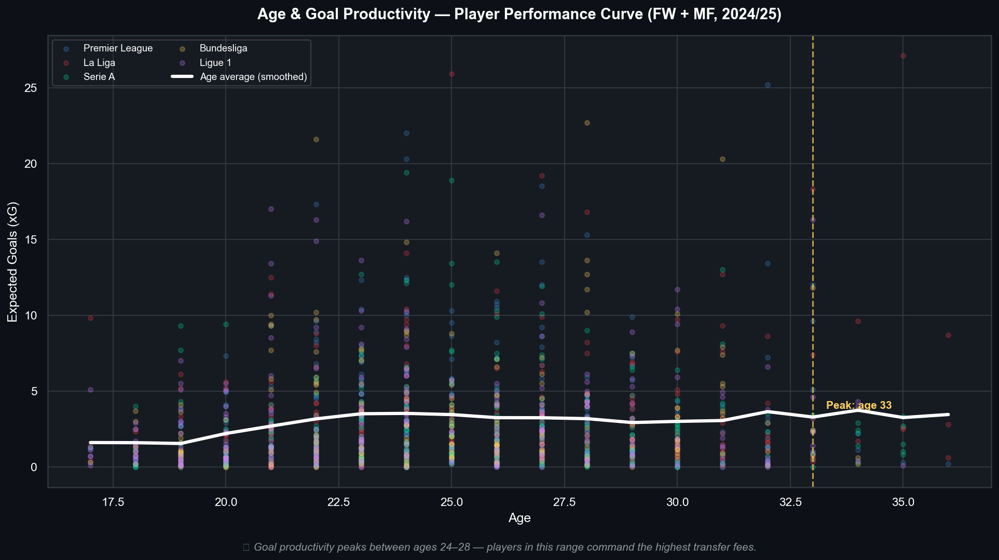
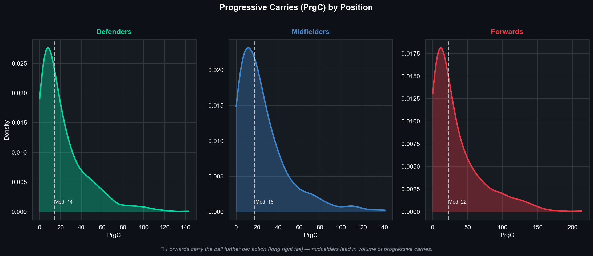
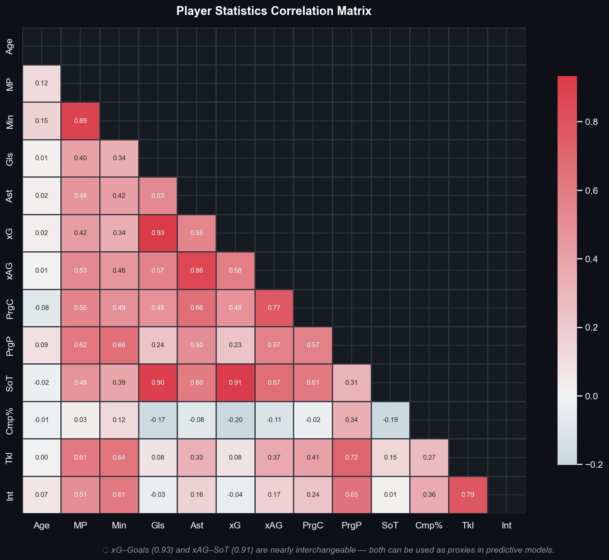
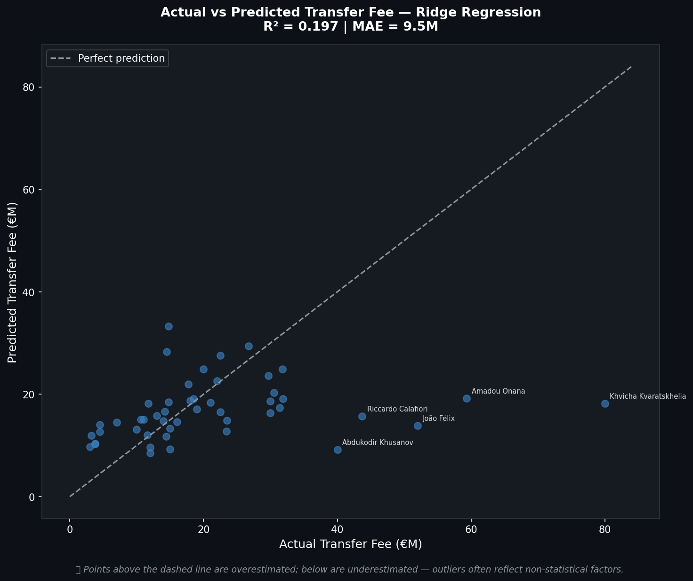
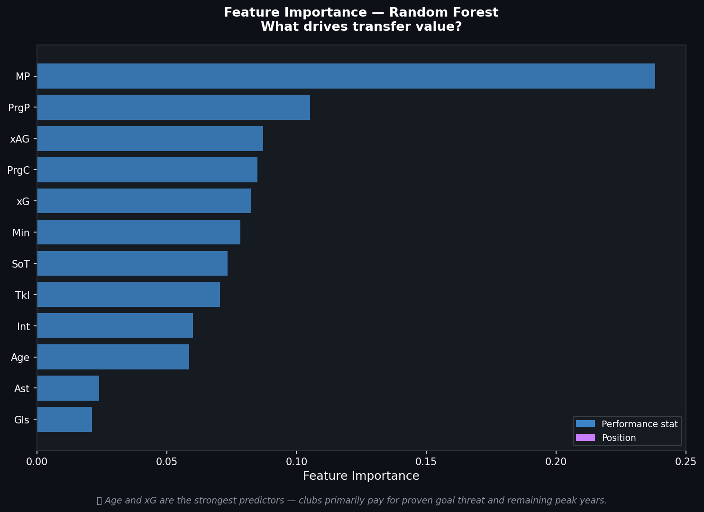

# ⚽ Football Transfer Analysis

End-to-end data analysis project exploring transfer spending, player market values, and financial efficiency across Europe's Big 5 leagues (2024/25 season).

## 🎯 Key Questions
- Which clubs get the best value from transfer spending?
- What factors influence a player's market value?
- Is there a correlation between transfer budget and league position?

## 🛠️ Tech Stack
| Tool | Purpose |
|------|---------|
| PostgreSQL | Database design & storage |
| Python (Pandas, Scikit-learn) | Data collection, cleaning & ML |
| R (ggplot2, dplyr) | Statistical analysis |
| Tableau | Interactive dashboard |

## 📁 Project Structure
```
football-transfer-analysis/
├── data/
│   ├── raw/          # Raw data from FBref via Kaggle
│   └── processed/    # Cleaned datasets & plots
├── sql/              # Database schema & queries
├── scripts/          # Python scripts
├── notebooks/        # R analysis
└── dashboard/        # Tableau files
```

## 📊 Data Sources
- Player statistics: FBref via Kaggle (2854 players, 5 leagues, 2024/25)
- Transfer data: Transfermarkt (339 transfers, summer 2024 + winter 2025)

## 📈 Analysis Highlights

### Goals Distribution by League


### xG vs Actual Goals


### Top 20 Most Efficient Clubs


### Age & Performance Curve


### Progressive Carries by Position


### Correlation Matrix


### Market Value Model — Actual vs Predicted


### Feature Importance


## 🔬 Key Findings
- xG and actual goals correlation: **r = 0.93** — xG is a highly reliable metric
- Peak goal productivity: **ages 24–28** across all leagues
- Market value model R²: **0.16** — highlights that transfer fees depend heavily on non-statistical factors (brand value, contract length, club need)
- Bundesliga clubs dominate efficiency rankings

## 🚧 Status
Phase 1 — Data Collection & Database Setup ✅  
Phase 2 — Data Cleaning & Analysis ✅  
Phase 3 — ML Model (Market Value Prediction) ✅  
Phase 4 — Tableau Dashboard ⏳
